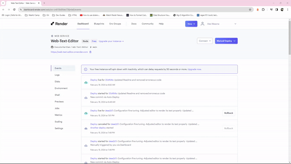
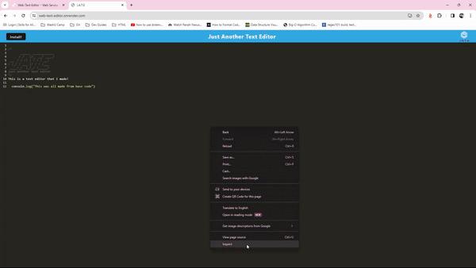
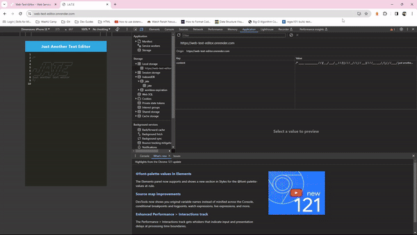

# Web-Text-Editor
This is a browser-based text editor that is a Progressive Web App (PWA), meaning a web delivered app that is designed to work on any platform and can be downloaded. This project can be found at this link [https://web-text-editor.onrender.com](https://web-text-editor.onrender.com)

## Description
This project provided me the opportunity to understand the webpack module and how to create a PWA. Specifically, this project allowed me to understand how important webpack plugin configuration was. Without proper configuration, all the assets in a bundle would have incorrect paths and then not be accessible for display. Additionally, a manifest cannot be generated without proper configuration so icons cannot be displayed correctly as well.    

This project also introduced me to service workers and their importance. Many of the features in a bundle seem to be implemented and require a service worker to execute. This means that webpack needs to be configured to copy a source service worker to a target destination that is accessible. It is also necessary to register the service worker for use. A general service worker was needed for this project, but I understand that specialized ones can be coded and built to meet a variety of needs.

Lastly, this project was an exploration into the local database of the browser. It is similar to local storage, but can be configured to store information with a key-value pair structure. Compared to MySQL and Mongoose, it is extremely limited. However, it clearly can have its uses as demonstrated in this project. 

## Installation
This project requires the following packages to function:
1) "babel" which can be found at [https://babeljs.io/](https://babeljs.io/)
2) "express" which can be found at [https://expressjs.com/](https://expressjs.com/) 
3) "webpack" which can be found at [https://webpack.js.org/](https://webpack.js.org/)

This project is hosted on render [https://render.com/](https://render.com/), so a user does not need to install the above packages to use the app.

## Usage
Once the user opens the app, they can begin to type in the text editor box. The text entered will persist, even if the app is closed, unless the user clears their cache. The user has the option to install the app via the install button. Once the button is clicked, a few prompts will guide the user through its installation. Installing the app allows data to persist and is continued between the offline and online states. 

The following GIF show this programs capabilities
1) Basic Functionality  

2) Behind the Browser  

3) Installability  
 
 
A video walkthrough of the app's functionality can be found <a href="./assets/Web-Editor-Demo.mp4"> here</a>.

## License
This product is protected by a [MIT License](http://choosealicense.com/licenses/mit).

## Contributing
The base code for this project was taken from [https://github.com/coding-boot-camp/cautious-meme](https://github.com/coding-boot-camp/cautious-meme). I, Alex Messina, edited the code to function. I had to edit the webpack configuration file, as well as a few other files to get the app to appear and function as intended. 

## Tests
No tests were prepared for this project. Errors can be noted in its behavior and display.

## Questions
My GitHub username is [ExecutorKarthan](https://github.com/ExecutorKarthan) and this project can be found at [https://github.com/ExecutorKarthan/Web-Text-Editor](https://github.com/ExecutorKarthan/Web-Text-Editor)

If you have questions or concerns about this project, please email me at me@alexmessina.dev
